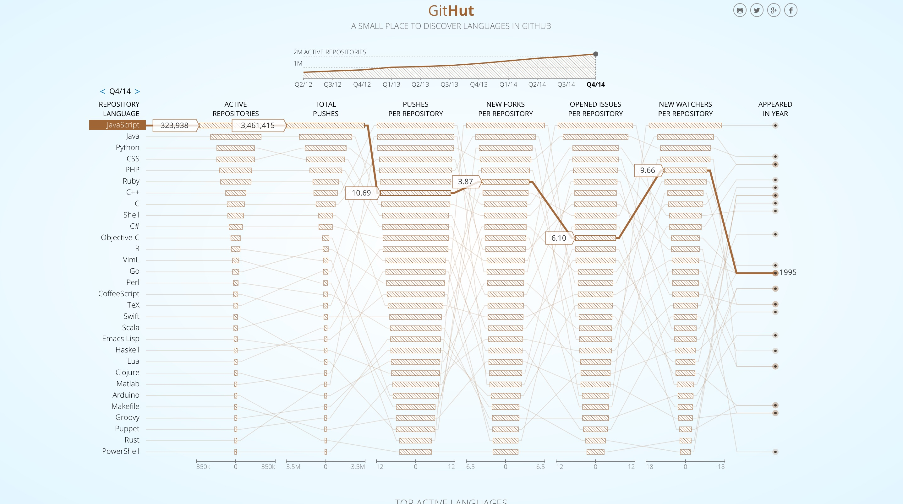

### 前言

该文章主要作为一个导读，对javaScript的学习知识点，ES6主要特性以及一些常用方式做大致了解;同时可以防止后续编码时忘记

### 内容清单

* [ ] ECMAScript语法特性
  * [ ] javaScript运行机制
* [ ] ECMAScript6特性
* [ ] CommonJS规范
* [ ] AMD规范
* [ ] CMD规范
* [ ] Node服务端编程
* [ ] 源码阅读列表
  * [ ] Dojo
  * [ ] SeaJS
  * [ ] base.js
  * [ ] jsoo
  * [ ] jquery
  * [ ] vue
  * [ ] Gatsby.js
* [ ] 书籍
  * [ ] 基于MVC的javaScript富应用开发
  * [ ] javaScript语言精粹

### JavaScript特性

> 有人会问，为什么我要针对javaScript做一系列文章去描述它呢？原因有两个，一个是github关于javaScript的仓库越来越多了，说明了javaScript的蓬勃发展，虽然可能是ECMAScript和node所带来的；第二个则是因为javaScript的起源是脚本语言，这就奠定了它做出一点东西会比较快的基础



##### JavaScript数据类型

> 编程语言都具有内建的数据结构，但各种编程语言的数据结构常有不同之处,JavaScript 是一种**弱类型**或者说**动态**语言。这意味着你不用提前声明变量的类型，在程序运行过程中，类型会被自动确定.

> 本节主要通过<span style="color:red">原始类型</span>和<span style="color:red">原型对象</span>两个点，针对javaScript数据的一系列问题做一次详解，理解数据在javaScript内部的存储(<span style="color:red">前提是需要读者了解javascript基础的一些数据类型和高阶的数据类型</span>)：
>
> 1. javaScript有哪些原始类型
> 2. 原型继承与原型链
> 3. new 关键字的内部实现机制
> 4. 值类型和引用类型的区别
> 5. == 与 ===, typeof 与 instanceof的区别
> 6. map, reduce, filter 等高阶函数
> 7. new 与构造函数, instanceof 与实例
> 8. Object.create 和 Object.assign
> 9. 二进制, 十进制, 十六进制, 科学记数法

* javaScript有哪些原始类型

  javaScript中共有6种原始类型：`string`，`number`，`boolean`，`null`，`undefined`，`symbol`

  ```javascript
  typeof "abc"; //"string"
  typeof String("abc"); //"string"
  typeof new String("abc"); //"object"
  typeof (new String("abc")).valueOf(); //"string"
  ```

  <span style="color:red"> `"abc".length` 为什么会有返回值？</span>

  因为javaScript在运算过程中会发生原始类型和对象之间强制转换

  <span style="color:red"> 原始类型是否可添加属性进行访问？</span>

  不可行，在向原始类型手动添加属性时，会将原始类型强制转换为对象，但是因为并没有引用指向对象，这导致对象在创建后会被垃圾回收导致不可用。

  [参考链接](https://javascriptweblog.wordpress.com/2010/09/27/the-secret-life-of-javascript-primitives/)

* 原型继承和原型链

  当谈到继承时，JavaScript 只有一种结构：对象。每个实例对象都有一个私有属性指向它的原型对象（**prototype**）。该原型对象也有一个自己的原型对象，层层向上直到一个对象的原型对象为 `null`。同时对象可通过`Object.create`实现属性继承


  prototype属性： 每一个函数都有一个 `prototype` 属性

  constructor属性：自定义构造函数，用于判断实例由哪个构造函数创建

  __proto__属性：指向实例的原型对象

* new 关键字的内部实现机制
  - 创建一个新对象；
  - 将构造函数的作用域赋值给新对象；
  - 执行构造函数中的代码；
  - 返回新对象

```javascript
var obj = {}; // 创建一个空对象
obj.__proto__ = constructor.prototype; // 添加__proto__属性，并指向构造函数的 prototype 属性。
constructor.call(this); // 绑定this
return obj;
```

* Object.create 和 Object.assign

  Object.create :使用现有的对象来提供新创建的对象的__proto__

  Object.assign:所有可枚举属性的值从一个或多个源对象复制到目标对象


