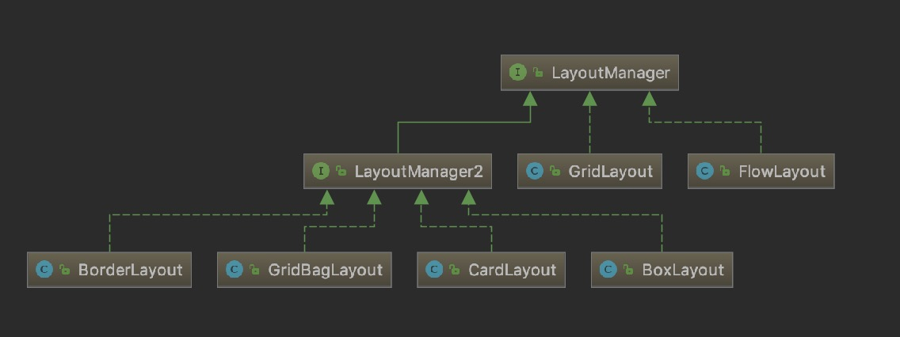
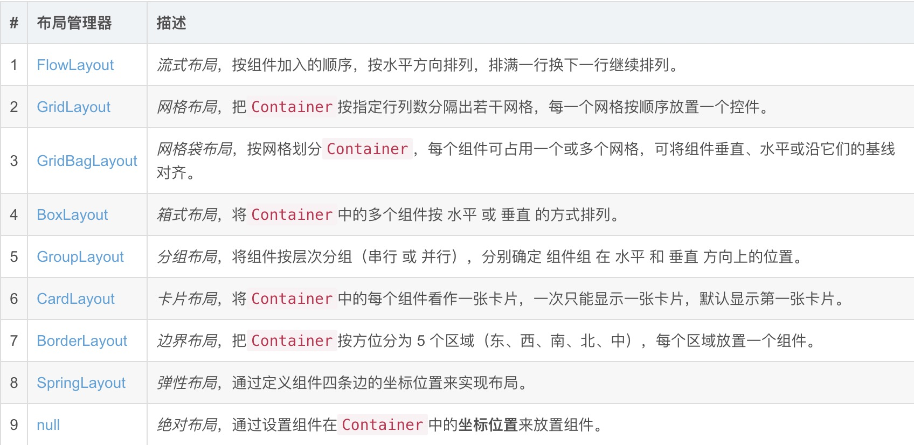
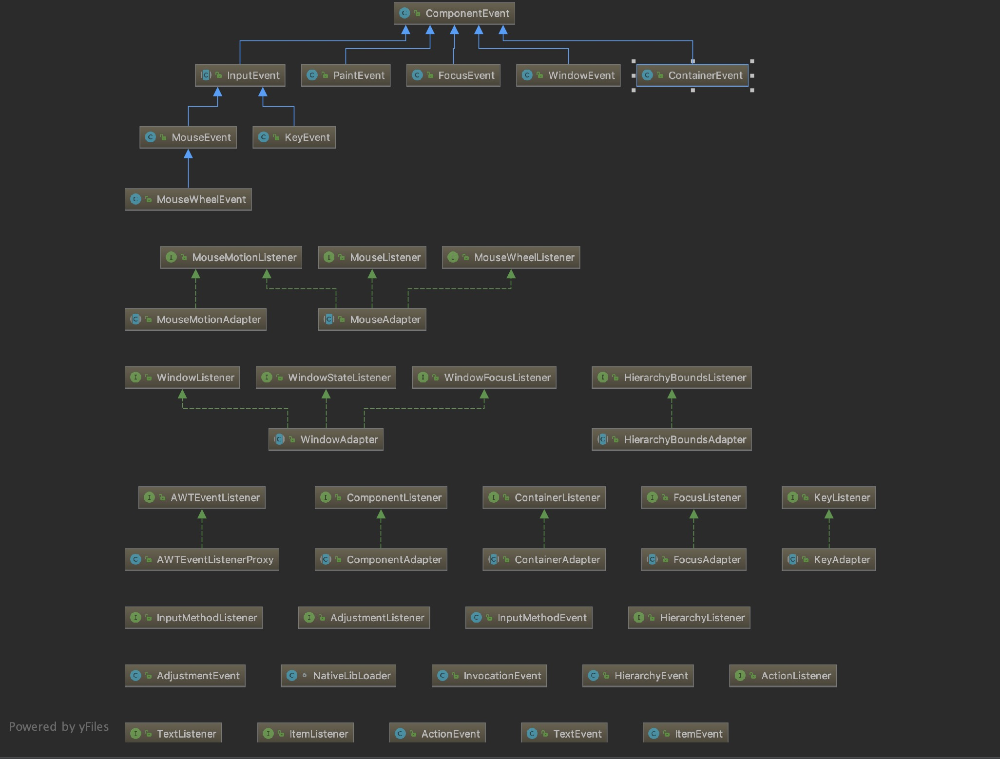
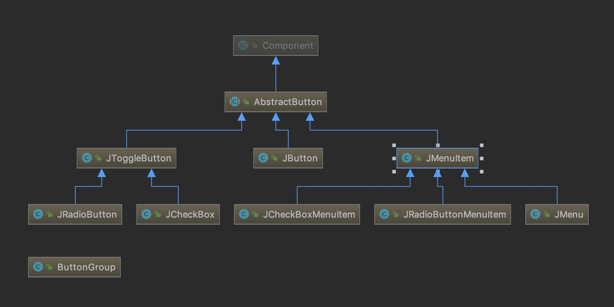
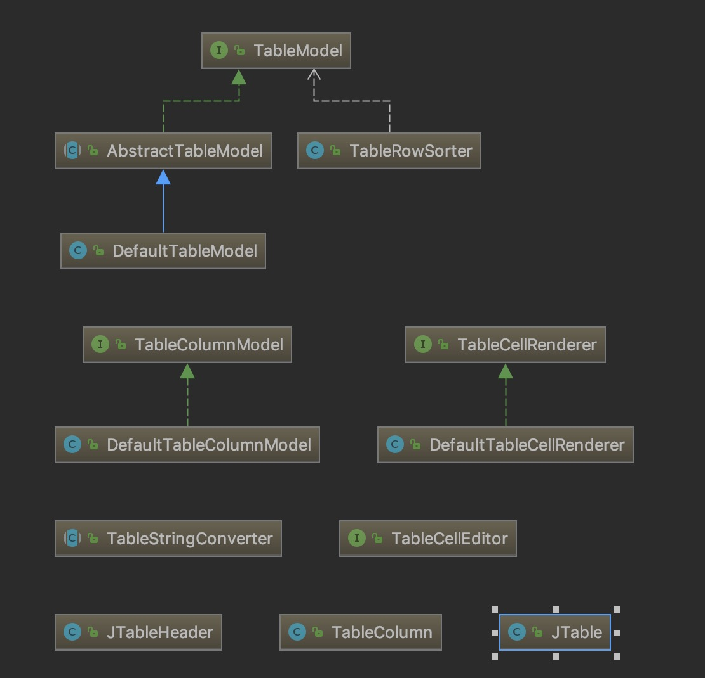
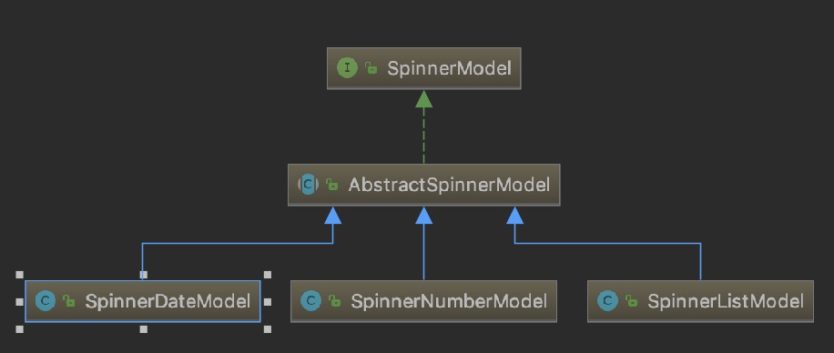

### 为什么使用javaGUI

在网络发展越来越迅速的时代，我们可以通HTML+CSS+JavaScript构建一个漂亮的应用；但是程序不只是跑在web上，还需要跑在桌面，app，嵌入式设备中，这就可以通过java去实现跨平台的GUI应用

### javaGUI技术点

> javaGUI开发主要包括java.awt包和javax.swing包

* 布局管理器
* 事件模型
* swing组件
* java swing标准库
* 可插拔UI
* 开源GUI库
* 样式自定义

###### 概述

* 组件结构

  > * 顶层容器
  >   * 菜单栏
  >   * 中间容器
  >     * 基本组件


###### 布局管理器



GUI布局方式主要包括：

1. BorderLayout

   > 具有四个边框区域和中央区域的概念；并且是容器的默认布局方式

2. FlowLayout

   > 浮动布局

3. GridLayout

   > 网格布局，可设置行数和列数

4. GridBagLayout

5. BoxLayout

   > 盒子布局，可在水平或垂直方向控制组件位置，并控制组件间距

6. CardLayout

   > 卡片布局



###### 事件模型

> GUI事件的驱动主要通过监听器进行驱动的；下图是java.awt.event的类图




###### swing组件

* 按钮

  

> 单选框可通过ButtonGroup实现排他性；而组合框则可以通过JComboBox实现

* 图标

  > 包括Icon，ImageIcon两个类，并且可以和JLabel搭配使用

* 文本

  > 常见的文本类组件包括JTextField,JPasswordField,JTextArea

* 列表

  > 可通过JList实现简单表格，JTree实现树状列表，JTable实现表格状列表

* 消息框

  > 可选择JOptionPane实现

* 菜单

  > 建立基本菜单可以使用JMenuBar，弹出式菜单可以使用JPopupMenu

* 面板

  > JTabbedPane是页签式对话框，基本对话框可以使用JDialog，文件对话框可以使用JFileChooser

* 进度条

  > 可以通过JProgressBar或JSlider实现进度条效果

* 容器

  > 顶级容器包括JFrame和JDialog两类，中间轻量级容器包括：
  >
  > * JPanel	一般轻量级面板容器组件
  > * JScrollPane	带滚动条的面板容器组件
  > * JSplitPane	分隔面板
  > * JTabbedPane	选项卡面板
  > * JLayeredPane	层级面板
  > * JMenuBar	菜单栏
  > * JToolBar	工具栏
  > * JPopupMenu	弹出菜单
  > * JInternalFrame	内部窗口

* 表格

  

* 其他

  * 图片

  * 下拉选择项

    > 可选择JComboBox实现下拉选择项

  * 颜色选择器

    > 基本颜色选择器可以使用JColorChooser

  * 文件选择器

    >建立基本的文件选择器可以选择JFileChooser

  * 时间选择器

    > 需要引入datepicker包进行使用

  * 文本格式化

    

###### 可插拔UI

```java
UIManager.setLookAndFeel(UIManager.getCrossPlatformLookAndFeelClassName)
```

###### 开源GUI库

> java内置GUI库中样式主要分为cross，motif，system(对UI层进行Mac，window系统选择)

* [Substance](http://insubstantial.github.io/insubstantial/substance/)
* [JTattoo](http://www.jtattoo.net/)

###### 样式自定义

> Java swing组件样式自定义的方式是重写组件，通过2D绘图的方式重写组件样式

[具体参考文档](https://blog.csdn.net/xietansheng/article/details/72814492)