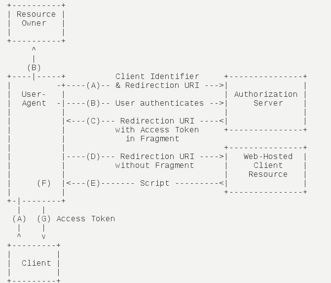

开放授权（OAuth）是一个开放标准，允许用户让第三方应用访问该用户在某一网站上存储的私密的资源（如照片，视频，联系人列表），而无需将用户名和密码提供给第三方应用
*********

## oauth协议说明

**oauth参与者**

 * `resource owner`        资源所有者，对资源具有授权能力的人
 * `resource server`       资源服务器，它存储资源，并处理对资源的访问请求
 * `Client`                第三方应用，它获得RO的授权后便可以去访问RO的资源
 * `authorization server`  授权服务器

**oauth流程概述**

1. 用户打开客户端以后，客户端要求用户给予授权。
2. 用户同意给予客户端授权。
3. 客户端使用上一步获得的授权，向认证服务器申请令牌。
4. 认证服务器对客户端进行认证以后，确认无误，同意发放令牌。
5. 客户端使用令牌，向资源服务器申请获取资源。
6. 资源服务器确认令牌无误，同意向客户端开放资源。

**oauth授权模式**

 * 授权码模式

1. 用户访问客户端，后者将前者导向认证服务器。
2. 用户选择是否给予客户端授权。
3. 假设用户给予授权，认证服务器将用户导向客户端事先指定的"重定向URI"（redirection URI），同时附上一个授权码。
4. 客户端收到授权码，附上早先的"重定向URI"，向认证服务器申请令牌。这一步是在客户端的后台的服务器上完成的，对用户不可见。
5. 认证服务器核对了授权码和重定向URI，确认无误后，向客户端发送访问令牌（access token）和更新令牌（refresh token）。

 * 简化模式

1. 客户端将用户导向认证服务器。
2. 用户决定是否给于客户端授权。
3. 假设用户给予授权，认证服务器将用户导向客户端指定的"重定向URI"，并在URI的Hash部分包含了访问令牌。
4. 浏览器向资源服务器发出请求，其中不包括上一步收到的Hash值。
5. 资源服务器返回一个网页，其中包含的代码可以获取Hash值中的令牌。
6. 浏览器执行上一步获得的脚本，提取出令牌。
7. 浏览器将令牌发给客户端。

 * 密码模式

1. 用户向客户端提供用户名和密码。
2. 客户端将用户名和密码发给认证服务器，向后者请求令牌。
3. 认证服务器确认无误后，向客户端提供访问令牌。

 * 客户端模式

1. 客户端向认证服务器进行身份认证，并要求一个访问令牌。
2. 认证服务器确认无误后，向客户端提供访问令牌。

 >Tips:
 >[参考文档1](http://www.ruanyifeng.com/blog/2014/05/oauth_2_0.html)
 >[参考文档2](https://tools.ietf.org/pdf/rfc6749.pdf)

## oauth实现

>实现步骤：
>1. 实现资源服务器
>2. 实现认证服务器
>3. spring security集成

